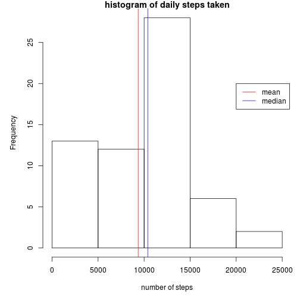
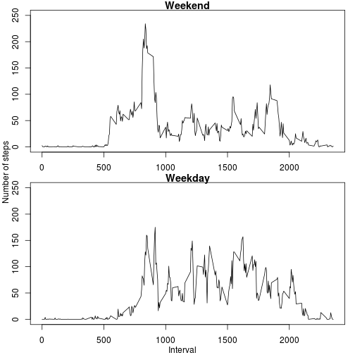

Activity monitoring devices measuring human movements regularly is aiming to find patterns in human behavior, and improve human health. 
Data is downloaded from [Activity monitoring data](https://d396qusza40orc.cloudfront.net/repdata%2Fdata%2Factivity.zip) to explore insight of monintered steps every 5 minuntes daily from October 1st to November 30th 2012.

## Loading and preprocessing the data

The data can be downloaded from [Activity monitoring data](https://d396qusza40orc.cloudfront.net/repdata%2Fdata%2Factivity.zip), and saved as 'activity.zip'


```r
url = 'https://d396qusza40orc.cloudfront.net/repdata%2Fdata%2Factivity.zip'
download.file(url, 'activity.zip', method='wget')
```
Decompress the zip data, using the 'unzip()' command in R:

```r
unzip('./activity.zip')
```
After unzipping, find the file 'activity.csv':

```r
list.files()
```

```
##  [1] "Abcd1234"          "Abcd1234.pub"      "activity.csv"     
##  [4] "activity.zip"      "doc"               "figure"           
##  [7] "figures"           "instructions_fig"  "missfont.log"     
## [10] "PA1_template.html" "PA1_template.md"   "PA1_template.Rmd" 
## [13] "q.log"             "README.md"
```
Read in 'activity.csv', using 'read.csv()' in R. Name the read-in data 'activity':

```r
activity = read.csv('./activity.csv',
                    colClasses = c('numeric', 'factor', 'numeric'))
```
Explore the structure of the data, using 'str()', 'head()', 'summary()' functions in R:

```r
str(activity)
```

```
## 'data.frame':	17568 obs. of  3 variables:
##  $ steps   : num  NA NA NA NA NA NA NA NA NA NA ...
##  $ date    : Factor w/ 61 levels "2012-10-01","2012-10-02",..: 1 1 1 1 1 1 1 1 1 1 ...
##  $ interval: num  0 5 10 15 20 25 30 35 40 45 ...
```


```r
head(activity)
```

```
##   steps       date interval
## 1    NA 2012-10-01        0
## 2    NA 2012-10-01        5
## 3    NA 2012-10-01       10
## 4    NA 2012-10-01       15
## 5    NA 2012-10-01       20
## 6    NA 2012-10-01       25
```

```r
summary(activity)
```

```
##      steps                date          interval     
##  Min.   :  0.00   2012-10-01:  288   Min.   :   0.0  
##  1st Qu.:  0.00   2012-10-02:  288   1st Qu.: 588.8  
##  Median :  0.00   2012-10-03:  288   Median :1177.5  
##  Mean   : 37.38   2012-10-04:  288   Mean   :1177.5  
##  3rd Qu.: 12.00   2012-10-05:  288   3rd Qu.:1766.2  
##  Max.   :806.00   2012-10-06:  288   Max.   :2355.0  
##  NA's   :2304     (Other)   :15840
```

Therefore, data 'activity' contains three variables:

* steps

* date

* interval

with 17568 records, where 2304 records have 'NA' as steps value; date is not recognized as Date variable in R. Therefore, convert the date column from Factor format into Date format using 'as.Date()' function. Once conversion is done, delete the orignal date column to avoid confusion.

```r
activity$dateformat = as.Date(activity$date, format = '%Y-%m-%d')
activity$date = NULL
```
## What is mean total number of steps taken per day?
1. To plot the histogram, first of all, the sum of all steps are calculated. 

```r
daily = tapply(activity$steps, activity$dateformat, sum, na.rm=T)
```
The histogram of the total number of steps taken each day is plotted as following:

```r
par(mfrow = c(1, 1), mar = c(4, 4, 1 , 1), oma = c(1, 1, 0, 0))
hist(daily, xlab='number of steps', main='histogram of daily steps taken')
abline(v=mean(daily, na.rm=T), col = 'red')
abline(v=median(daily, na.rm=T), col = 'blue')
legend(20000, 20, c('mean', 'median'), lty=c(1, 1),col = c('red', 'blue'))
```

 

```r
# to save it:
#dev.copy(png, file ='./figures/histogram.png')
#dev.off()
```
2. The mean and median total number of steps taken per day are calculated as:

```r
mean(daily, na.rm=T)
```

```
## [1] 9354.23
```

```r
median(daily, na.rm=T)
```

```
## [1] 10395
```
##  What is the average daily activity pattern
1. Make a time series plot (i.e. type = "l") of the 5-minute interval (x-axis) and the average number of steps taken, averaged across all days (y-axis):

```r
#intervalMean is the mean of the steps at each 5 minute interval over all the days
intervalMean = with(activity, tapply(steps, interval,  mean, na.rm=T))
#intervalDaily is the minutes number of the intervals. 
# Everyday appears the same pattern in munites (ex, 0, 5, 10, .....2355)
intervalDaily = unique(activity$interval)
# plot time series
plot(intervalDaily, intervalMean, type='l', main = 'Average steps and daily interval',
     xlab='5-minute interval', ylab='average steps')
```

 

```r
# to save the plot into file:
#dev.copy(png, file ='./figures/5minAve.png')
#dev.off()
```

2. Which 5-minute interval, on average across all the days in the dataset, contains the maximum number of steps?

```r
intervalDaily[which.max(intervalMean)]
```

```
## [1] 835
```
## Imputing missing values
1. Calculate and report the total number of missing values in the dataset (i.e. the total number of rows with NAs)

```r
table(is.na(activity$steps))
```

```
## 
## FALSE  TRUE 
## 15264  2304
```

2. To fill the NAs in the data 'activity', strategy is developed to replace NAs with the average steps at the minute interval when the step is recorded over the days. To develop this strategy, the data 'activity' is duplicated to a data table called 'DT'.

```r
library(data.table)
DT = data.table(activity)
#In DT, a new variable 'intervalMean' is set to take the mean of the subsets of records, categorized by interval values
DT[, intervalMean := mean(steps, na.rm=T), by=interval]
```

```
##        steps interval dateformat intervalMean
##     1:    NA        0 2012-10-01    1.7169811
##     2:    NA        5 2012-10-01    0.3396226
##     3:    NA       10 2012-10-01    0.1320755
##     4:    NA       15 2012-10-01    0.1509434
##     5:    NA       20 2012-10-01    0.0754717
##    ---                                       
## 17564:    NA     2335 2012-11-30    4.6981132
## 17565:    NA     2340 2012-11-30    3.3018868
## 17566:    NA     2345 2012-11-30    0.6415094
## 17567:    NA     2350 2012-11-30    0.2264151
## 17568:    NA     2355 2012-11-30    1.0754717
```
3. Fill in the NAs in the new data set (DT):

```r
DT[is.na(steps),]$steps = DT[is.na(steps),]$intervalMean
```

4. With all the NAs filled in step variable (DT), the daily steps taken are calculated and passed to the variable 'daily_fill':

```r
daily_fill =tapply(DT$steps, DT$dateformat, sum, na.rm=T)
```

the mean and median are calculated to compare with the steps in raw data activity with NAs (activity). After filling the NAs the median and mean become the same(10766.19) while before filling up NAs, median (10395) is bigger than mean (9354.23). The way to calculate means and medians for both daily steps with NAs or filledups are listed for comparison.

```r
mean(daily, na.rm=T)
```

```
## [1] 9354.23
```

```r
mean(daily_fill, na.rm=T)
```

```
## [1] 10766.19
```

```r
median(daily, na.rm=T)
```

```
## [1] 10395
```

```r
median(daily_fill, na.rm=T)
```

```
## [1] 10766.19
```

Two histograms of steps in DT and activity are plotted to compare. Number of bins are chosen to be 10 to reveal the more detailed change due to filling NAs. First of all, the peak value of filled-in data (20-25 in frequency) is higher than one of raw data (around 17 in frequency). The frequency around "zero" bin of filled-in data (<5) is lower than raw data (around 10). This indicates that filling the NAs with interval mean would truly recognize the days of absolutely no steps from days of limited records that result in 'zero' steps. 

Secondly, as said in the previous point, the median and mean overlap at filled-in data, but not the same at raw data.

```r
par(mfrow = c(2, 1), mar = c(2, 2, 1 , 1), oma = c(1, 1, 0, 0))
hist(daily_fill, breaks = 10, ylim=c(1,25), main ='Histogram of Filled-in Data')
abline(v = mean(daily_fill), col = 'red')
abline(v = median(daily_fill), col = 'blue')
legend(15000, 20, c('mean', 'median'), lty=c(1, 1),col = c('red', 'blue'))
hist(daily, breaks=10, ylim=c(1,25),main = 'Histogram of raw Data')
abline(v = mean(daily), col = 'red')
abline(v = median(daily), col = 'blue')
legend(15000, 20, c('mean', 'median'), lty=c(1, 1),col = c('red', 'blue'))
mtext('Steps', out=T, side=1)
mtext('Frequency', out=T, side=2)
```

 

```r
# to save this plot:
#dev.copy(png, file ='./figures/histogram_filled.png')
#dev.off()
```
## Are there differences in activity patterns between weekdays and weekends?
1. A new factor variable in the dataset is created with two levels -"weekday" and "weekend" indicating whether a given date is a weekday or weekend day.

```r
# convert formatted date as weekdays using weekdays()
activity$daytype[(weekdays(activity$dateformat) == 'Saturday')
                 |(weekdays(activity$dateformat) == 'Sunday')] = 'Weekend'
activity$daytype[!((weekdays(activity$dateformat) == 'Saturday')
                 |(weekdays(activity$dateformat) == 'Sunday'))] = 'Weekday'
# convert the daytype to factor from character
activity$daytype = as.factor(activity$daytype)
```
2. A panel plot is made containing a time series plot of the 5-minute interval (x-axis) and the average number of steps taken, averaged across all weekday days or weekend days (y-axis):

```r
meanDaily = with(activity, tapply(steps, list(interval, daytype), mean, na.rm=T))
par(mfrow = c(2, 1), mar = c(2, 2, 1 , 1), oma = c(1, 1, 0, 0))
plot(intervalDaily, meanDaily[, 1], type='l', main = 'Weekend', xlab= '', ylim = c(0, 250))
plot(intervalDaily, meanDaily[, 2], type='l', main = 'Weekday', xlab='interval',
     ylim = c(0, 250))
mtext('Number of steps', outer=T, side=2)
mtext('Interval', outer=T, side=1)
```

 

```r
#dev.copy(png, file ='./figures/weekdays.png')
#dev.off()
```
It appears that there is a difference between weekdays and weekends regarding the steps taken. During the weekends, average number of steps peaks around 9:00am. During the weekdays, the average steps are relatively more evenly distributed along the day time period. 
